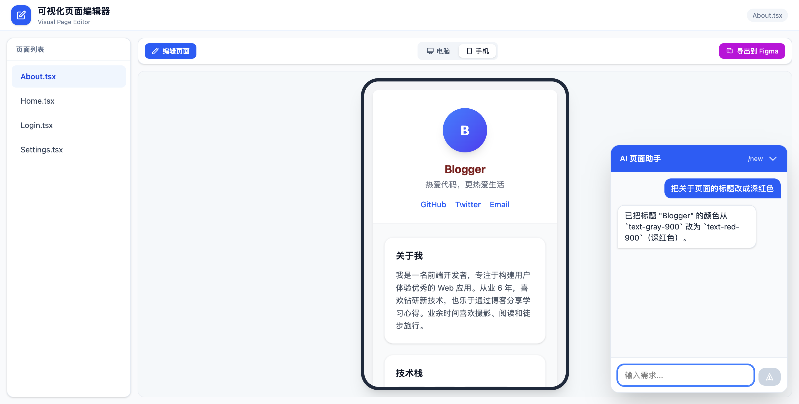
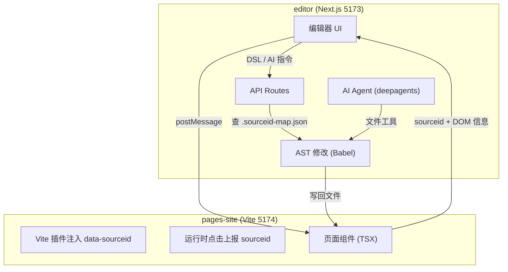
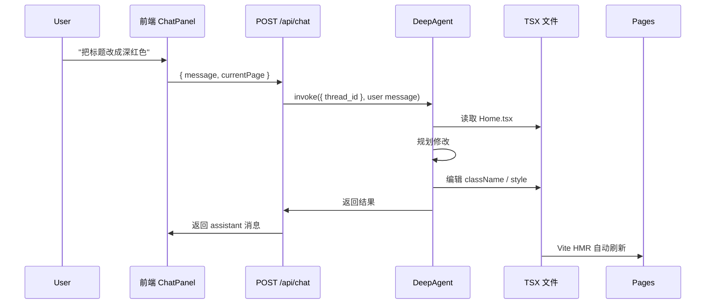
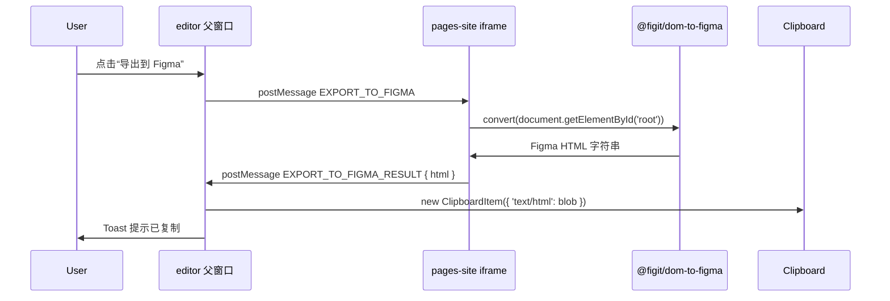

# Vite TSX Editor — AI 原生可视化 React 编辑器

> 用自然语言描述需求，AI 直接改代码；点选页面元素，可视化编辑属性；改完一键导出到 Figma。

这是一个面向 **React + TypeScript** 的 AI 原生可视化页面编辑器。它不是“可视化拖拽生成代码”的低代码工具，而是把 **大模型 Agent**、**AST 代码修改** 和 **可视化点选编辑** 三种能力结合在一起：你可以像跟前端工程师对话一样让 AI 改页面，也可以像用 Figma 一样点选元素微调细节。

---

## 核心能力

- **🤖 AI 生成 / 修改页面**：输入自然语言，Agent 读取 TSX 源码、修改代码、保存文件，Vite HMR 自动刷新预览。
- **🖱️ 可视化点选编辑**：在 iframe 预览区点击任意元素，右侧面板显示源码位置与可编辑属性，修改后实时生成 DSL 回写源码。
- **🎨 一键导出到 Figma**：把当前页面整体转换为 Figma 可粘贴的节点数据，复制到剪贴板，直接在 Figma 里粘贴。
- **📱 桌面 / 手机视图切换**：一键切换预览尺寸。
- **💬 多轮对话上下文**：基于 LangGraph checkpointer 维护 `thread_id`，刷新页面后历史记录不会丢失。

---

## 整体效果



---

## 架构总览



整个项目拆成两个子应用：

- **`editor/`**（Next.js）：控制中心，负责 UI、API、AI Agent、AST 修改。
- **`pages-site/`**（Vite）：被编辑的页面集合，负责 sourceid 注入和运行时消息桥。

---

## 1. AI 如何生成 / 修改页面

### 1.1 Agent 工作流



- 使用 `deepagents` 的 `createDeepAgent` 构建带文件系统工具的页面编辑 Agent。
- 模型调用走 `ChatOpenAI`（配置为 Kimi API）。
- `checkpointer = new MemorySaver()` 按 `thread_id` 保存完整对话状态，刷新页面后 `GET /api/chat` 可恢复历史。
- 每次请求都会把当前页面名注入到 user 消息中，Agent 知道要改哪个文件，也能处理用户中途切换页面的情况。

### 1.2 从自然语言到代码变更

Agent 并不直接操作 DOM，而是操作源代码：

1. 读取 `pages-site/src/pages/{currentPage}`
2. 解析 AST，定位到需要修改的 JSXElement
3. 修改 `className`、`style`、文本内容等
4. Babel generate 后写回文件
5. Vite HMR 检测到文件变化，自动刷新 iframe 预览

这种“改源码 -> HMR 刷新”的方式让 AI 的修改可复现、可回退、可 Review，而不是一次性地把 DOM 拍平。

---

## 2. 人工点选编辑如何实现（sourceid → DSL → AST → Code）

### 2.1 sourceid：把 DOM 节点映射回源码

`pages-site/server/vite-plugin-sourceid/index.ts` 是一个自定义 Vite 插件，在 `transform` 阶段对每个 `.tsx` 页面做源码级插桩：

1. 用 Babel parser 把 TSX 转成 AST。
2. 给每个 JSXElement 分配一个 AST 路径，例如 `About.tsx:jsxElement[0].jsxElement[0]`。
3. 对路径做 SHA256 哈希，取前 12 位作为短 `sourceid`，例如 `fddfe51215f8`。
4. 把 `data-sourceid="fddfe51215f8"` 注入到该元素的 opening element。
5. 把 `sourceid → { filePath, astPath, start, end, code }` 写入 `pages-site/.sourceid-map.json`。

这样页面渲染后，每个 DOM 元素都带有一个不可见的“源码地址”。

### 2.2 运行时通信

`pages-site/src/runtime.ts` 监听 `document.click`：

- 找到最近带 `data-sourceid` 的元素。
- 把 `sourceid`、文本、标签名、属性通过 `window.parent.postMessage` 发给 editor。

editor 收到消息后，右侧面板 `SelectionPanel` 会显示：

- 文件路径、行列号
- 对应源码片段
- 元素标签名
- 当前 DOM 属性

### 2.3 DSL 操作

用户在右侧面板修改后，会生成 DSL 数组，发送到 `POST /api/apply`：

```json
[
  { "sourceid": "fddfe51215f8", "op": "setText", "value": "新标题" },
  { "sourceid": "fddfe51215f8", "op": "setAttr", "name": "className", "value": "text-red-900 font-bold" },
  { "sourceid": "fddfe51215f8", "op": "removeAttr", "name": "style" }
]
```

### 2.4 AST 修改与回写

`editor/src/pages/api/apply.ts`：

1. 从 `.sourceid-map.json` 查到 `sourceid → { filePath, astPath }`。
2. 读取对应 TSX，用 Babel parser 生成 AST。
3. 按 `astPath` 导航到目标 JSXElement。
4. 根据 `op` 执行 `setText`、`setAttr` 或 `removeAttr`。
   - `setAttr` 遇到 `style` 会自动处理成 JSX 表达式对象 `{ color: 'red' }`。
5. Babel generate 回 TSX 代码，写回文件。
6. Vite HMR 自动刷新 iframe 预览。


---

## 3. 导出到 Figma 如何实现

因为 editor 和 pages-site 运行在不同端口（跨域），DOM 转换必须在 pages-site 内部完成，而剪贴板写入必须在 editor 父窗口完成（否则 iframe 没焦点会报 `Document is not focused`）。



- `pages-site/src/export-to-figma.ts` 监听 `EXPORT_TO_FIGMA` 消息，调用 `@figit/dom-to-figma` 转换页面根元素。
- 转换结果是 Figma 专用的 HTML 剪贴板信封，通过 `postMessage` 传回 editor。
- editor 在父窗口构造 `ClipboardItem` 并写入剪贴板，用户直接在 Figma 中粘贴即可。

---

## 技术栈

- **编辑器前端**：Next.js 14、React 18、TypeScript、Tailwind CSS、sonner
- **页面项目**：Vite 5、React 18、TypeScript、Tailwind CSS
- **AST 处理**：@babel/parser、@babel/traverse、@babel/generator、@babel/types
- **AI Agent**：deepagents、@langchain/langgraph、@langchain/openai
- **Figma 导出**：@figit/dom-to-figma、@figit/fig-kiwi
- **通信**：iframe + cross-origin `postMessage`

---

## 为什么这样设计

- **AI 改源码，而不是改 DOM**：代码变更是可追溯的，能利用 Git diff、Vite HMR，也能和人工编辑混合使用。
- **sourceid 把 DOM 和 AST 打通**：不需要在运行时维护复杂的映射表，编译期一次性注入即可。
- **DSL 是中间层**：前端只表达“想改什么”，后端决定“怎么改 AST”，前后端解耦，也便于 AI 直接复用同一套 apply 逻辑。
- **Figma 导出拆成“生成在 iframe、写入在父窗口”**：既解决跨域 DOM 访问问题，又解决剪贴板焦点问题。

---

## 快速开始

```bash
npm install
npm run dev
```

同时启动：

- Editor: http://localhost:5173/
- Pages site: http://localhost:5174/

打开编辑器后，你可以：

1. 在左侧切换页面；
2. 在右侧 AI 助手里输入自然语言让 AI 改页面；
3. 或者点击“编辑页面”，在预览区点选元素，在右侧面板微调属性；
4. 改完后点击顶部“导出到 Figma”，复制到 Figma 中粘贴。

---

## 受启发于

[onlook-dev/onlook](https://github.com/onlook-dev/onlook)
