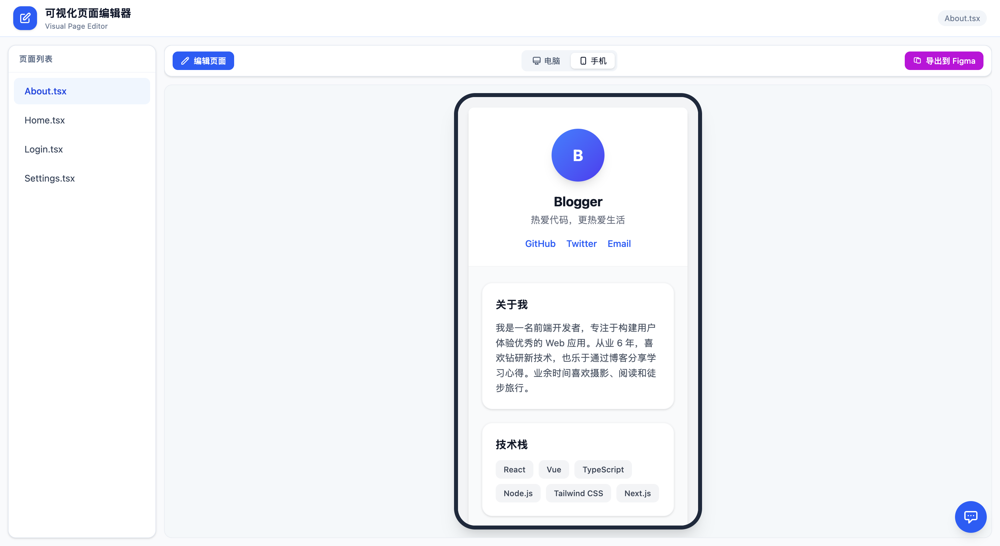
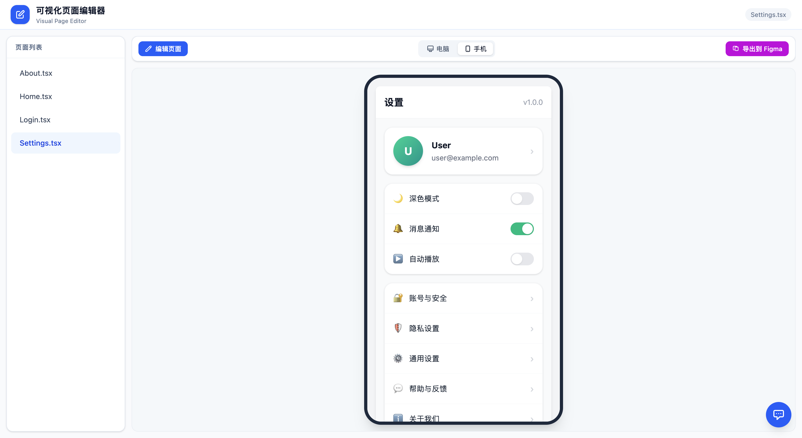
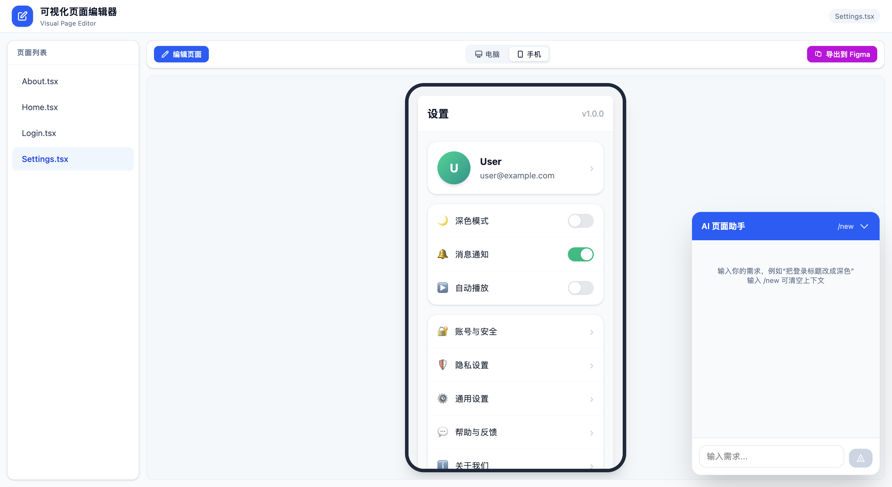
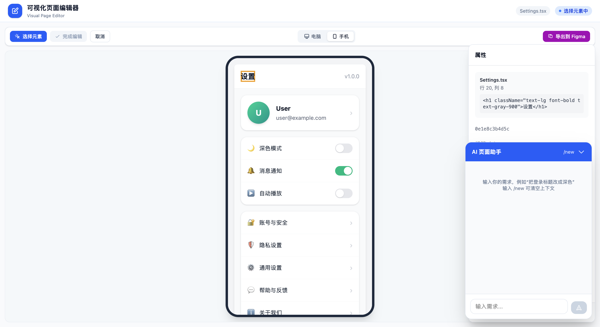

# Vite TSX Editor — 可视化 React 页面编辑器

一个基于 **Next.js + Vite** 的可视化 React / TypeScript 页面编辑器。editor 作为“控制中心”嵌入 pages-site 预览页面，支持点选编辑、AI 对话式修改，以及一键导出到 Figma。

---

## 项目组成

```text
.
├── editor/          # Next.js 编辑器（端口 5173）
├── pages-site/      # Vite 示例页面项目（端口 5174）
├── package.json     # workspaces + 启动脚本
└── README.md
```

| 子项目 | 技术 | 职责 |
|---|---|---|
| `editor/` | Next.js 14 + React 18 + TypeScript + Tailwind CSS | 编辑器 UI、Next.js API 路由、AI 助手、AST 文件修改 |
| `pages-site/` | Vite 5 + React 18 + TypeScript + Tailwind CSS | 被编辑的示例页面、sourceid 注入、运行时消息桥 |

---

## 核心功能

### 1. 可视化点选编辑

在 editor 的 iframe 预览区点击任意元素，右侧面板会显示：

- 元素所在文件路径与源码行列号
- 当前 JSX 片段
- 标签名、文本内容
- 颜色、背景、字体大小、字重、内外边距、显示方式
- 类名（`className`）
- 自定义属性

修改后点击“完成编辑”，DSL 操作会回写到原始 TSX 文件，Vite HMR 自动刷新预览。

### 2. AI 页面助手

右下角悬浮的 AI 助手基于 LangGraph / deepagents：

- 支持多轮对话，服务端通过 `thread_id` 维护上下文
- 可读取并修改页面 TSX 文件
- 对话历史在页面刷新/重新打开面板后会自动恢复
- 输入 `/new` 开启新会话

### 3. 导出到 Figma

点击顶部工具栏“导出到 Figma”，当前预览页面会被 `@figit/dom-to-figma` 转换为 Figma 可粘贴的 HTML 剪贴板数据，复制后直接在 Figma 中粘贴即可。

### 4. 桌面 / 手机视图切换

支持一键切换 desktop 与 mobile 预览尺寸。

### 5. 页面列表

左侧导航列出 `pages-site/src/pages/` 下的所有页面，点击即可切换预览。

---

## 架构与实现

### sourceid 生成与注入

`pages-site/server/vite-plugin-sourceid/index.ts` 在 Vite `transform` 阶段：

1. 用 Babel parser 把 `src/pages/**/*.tsx` 转成 AST
2. 给每个 JSXElement 分配 AST 路径，例如 `About.tsx:jsxElement[0].jsxElement[0]`
3. 对该路径做 SHA256 哈希取前 12 位，得到短 sourceid，例如 `fddfe51215f8`
4. 把 `data-sourceid="fddfe51215f8"` 注入到该元素的 opening element 上
5. 把 `sourceid → { filePath, astPath, start, end, code }` 写入 `pages-site/.sourceid-map.json`

### DOM → editor 通信

`pages-site/src/runtime.ts` 监听页面点击，找到最近的带 `data-sourceid` 的元素，通过 `window.parent.postMessage` 把 sourceid、文本、标签名和属性发给 editor。

### 编辑与 DSL 下发

editor 收到 sourceid 后生成 DSL 操作数组，发到 Next.js API 路由 `POST /api/apply`：

```json
[
  { "sourceid": "fddfe51215f8", "op": "setText", "value": "New text" },
  { "sourceid": "fddfe51215f8", "op": "setAttr", "name": "className", "value": "title" },
  { "sourceid": "fddfe51215f8", "op": "removeAttr", "name": "style" }
]
```

### AST 修改与回写

`editor/src/pages/api/apply.ts`：

1. 从 `pages-site/.sourceid-map.json` 查到 `fddfe51215f8 → { filePath, astPath }`
2. 读取对应 TSX 文件，用 Babel parser 生成 AST
3. 按 astPath 导航到目标 JSXElement
4. 根据 `op` 执行 `setText`、`setAttr` 或 `removeAttr`
5. Babel generate 回 TSX 代码并写回文件
6. Vite HMR 自动刷新 iframe 预览

### AI 助手

`editor/src/lib/agent.ts` + `editor/src/pages/api/chat.ts`：

- 使用 `deepagents` 的 `createDeepAgent` 构建带文件系统工具的页面编辑 Agent
- `MemorySaver` checkpointer 按 `thread_id` 保存对话状态
- `GET /api/chat` 可拉取当前 thread 的历史消息
- `ChatPanel` 挂载时自动加载历史

### 导出到 Figma

`pages-site/src/export-to-figma.ts`：

- 监听 editor 发来的 `EXPORT_TO_FIGMA` postMessage
- 使用 `@figit/dom-to-figma` 转换页面根元素
- 把生成的 Figma HTML 字符串回传 editor
- editor 在父窗口中构造 `ClipboardItem` 并写入剪贴板（避免 iframe 跨域焦点问题）

---

## 支持的 DSL 操作

| op | 说明 |
|---|---|
| `setText` | 替换文本内容 |
| `setAttr` | 新增或更新属性（`style` 会处理成 JSX 对象） |
| `removeAttr` | 删除属性 |

---

## 页面截图

### 编辑器首页预览


### 关于页面预览



### 登录页面预览


### 设置页面预览



### AI 助手对话



### 点选编辑模式


### 导出到 Figma



---

## 快速开始

```bash
npm install
npm run dev
```

这会同时启动两个服务：

- Editor: http://localhost:5173/
- Pages site: http://localhost:5174/

打开 editor，在左侧选择页面，在 iframe 预览区点击元素，在右侧面板修改属性后点击“完成编辑”。

---

## 为什么这样拆分

- **`pages-site` Vite 插件**只负责 sourceid 注入。它必须挂在 pages 自己的 Vite transform 流水线里。
- **Editor Next.js API 路由**负责实际文件修改。editor 是“控制中心”，接收用户动作并把变更写回磁盘。
- **AI 与 Figma 导出**等高级功能都通过 editor 与 pages-site 之间的 `postMessage` 协作完成，保持 pages-site 本身轻量、可替换。

---

## 受启发于

[onlook-dev/onlook](https://github.com/onlook-dev/onlook)
